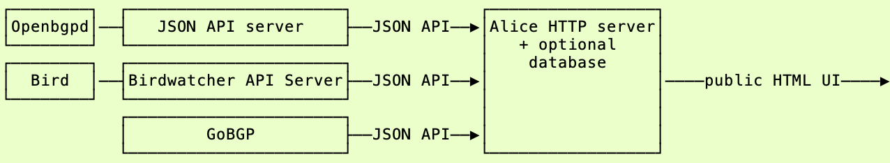
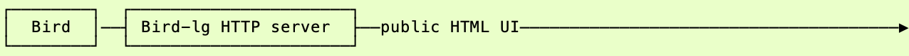
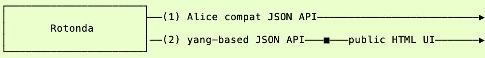

## Alice

The Alice Looking Glass[^1] is a stand-alone web server + optional database, so in fact, a complete server-side web application. It is supposed to work like this:

With the exception of GoBGP all routing daemons need another daemon to host the JSON API that interfaces with the Alice daemon (which also may rely on a database daemon).

Alice can ingress data from multiple different BGP daemons in one Alice instance.

## Bird-lg

For Bird there's another daemonm, called Bird-lg[^2] that directly creates a (public facing) web server with a HTML UI. It's supposed to work like this:

So that's one extra public-facing daemon

## Paths for Rotonda to take

I see two options (we can do both):

### 1. Alice compat JSON API

Reverse engineer Barry O'Donovan's Birdwatcher API[^3] and host that API on Rotonda. Rotonda can now be hooked up to Alice.

Advantages:
- Ready-to-roll integration with Alice, which can also host other daemons, or multiple Rotondas.
- Network perimeter is unchanged, Rotonda can run in the core, and the Alice lives on the perimeter.
- Limited amount of work to implement for Rotonda

Disadvantage:
- Implementing a unstructured, messy, ad-hoc API that's meant to be tightly coupled with Bird output is not great, and requires corner-cutting.
- Not all relevant data in Rotonda's RIBs can be modeled.
- Zero guarantees about stability of this API, we don't even know if Alice implements all of the Birdwatcher API. Also, no versioning, no schema
### 2. Shove everything of the table

...and replace all daemons with one Rotonda instance that acts as a 
- Routing daemon (over BGP, just like the 'classic' BGP daemons, or over BMP), 
- A database and
- A web-server with a public-facing web UI

Advantages:
- Greatly reduced operational complexity, one daemon to rule them all.
- We can steal Teun Vink's web UI for the NLNOG Ring LG [^4].

Disadvantages:
- Integrating different routing daemons (not Rotonda) cannot be done. Multiple Rotondas could work in a distributed setup.
- Non-trivial amount of (design) work, involving YANG models.

Be Aware:
- Rotonda may break network topology in this setup, Rotonda needs to live in the perimeter (DMZ) and in the core (to interface with routers). Distributed setup may counter this.

[^1]: https://github.com/alice-lg/alice-lg/
[^2]: https://github.com/sileht/bird-lg/
[^3]: https://github.com/alice-lg/birdwatcher
[^4]: https://github.com/NLNOG/lg.ring.nlnog.net/
